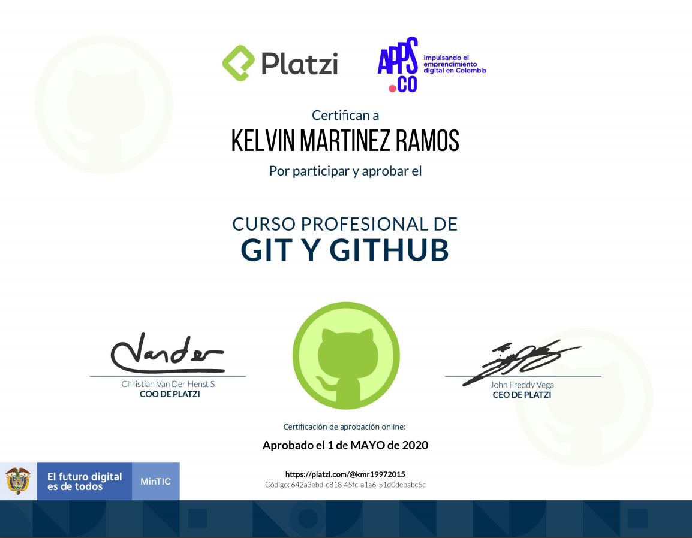
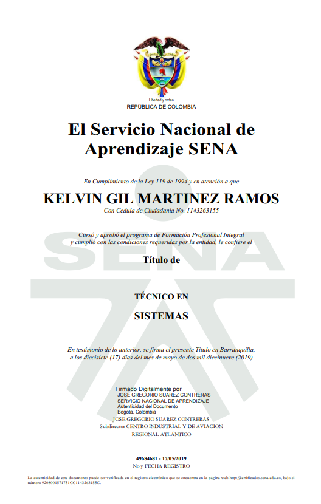

# Informacion personal

***
Nombres: Kelvin Gil

Apellidos: Martinez ramos

C.C: 1143263155
***
# Sobre mi
## Kelvin Martinez ramos
Estudiante de Analisis y desarrollo de sistemas de informacion en el centro industrial y de aviacion SENA.

Soy una persona empeñada en perseguir lo que quiere, dedicado, sincero, comprometido y responsable.
***
# Referncias familiares

Nombre: Loida Ramos

 Parentesco: Madre

Telefono: 3203659599  

Ocupacion: Ama de casa
***

Nombre: Elkin Martinez  

Parentesco: Hermano

Telefono: 3015254687

Ocupacion: Taxista
***

# Contacto

Telefono: 3022547825

Direccion: Cra 19#115-21

E-Mail: kmr19972015@gmail.com
***
# Titulos
- Tecnico de sistemas
- Curso profesional Git y Github
- Metodologia agil: SCRUM

***
# Certificados

***

***